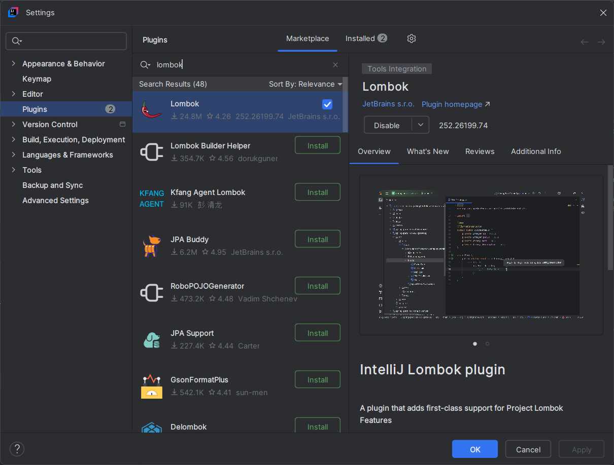
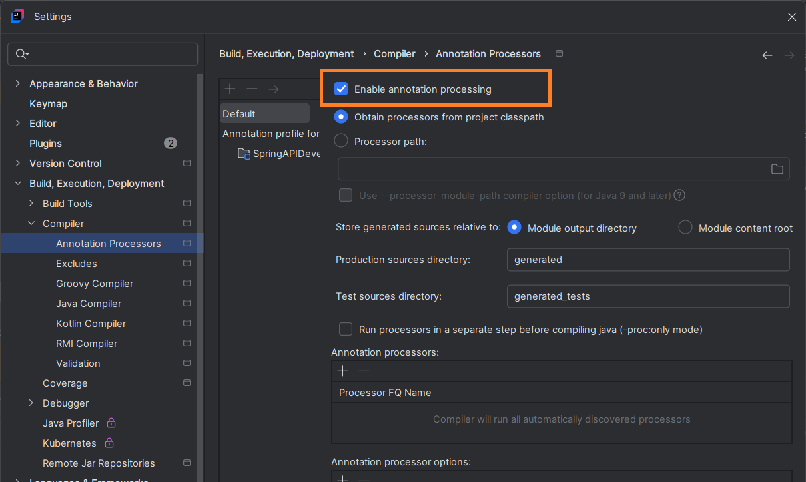
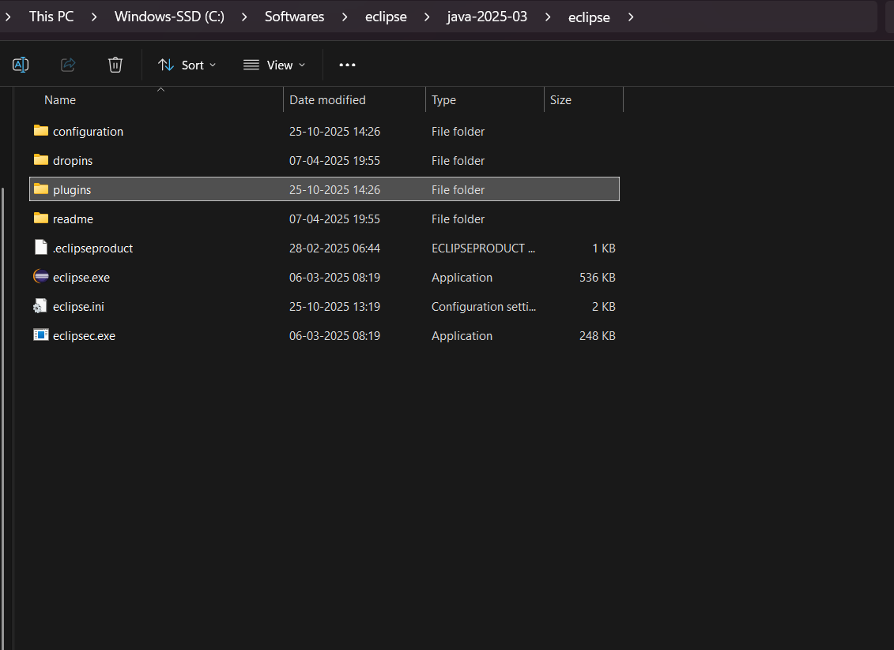

Download the project, unzip it and open it in your IDE.
The prerequisite is to have the Postgres Database installed on your machine.

Install Lombok plugin on your IDE to ensure the lombok annotations work as expected.

In IntelliJ Idea:
1. **Step 1:** Go to File -> Settings -> Plugins -> Marketplace -> Lombok plugin -> Install.

2. **Step 2:** Post installation, Go to File -> Settings -> Build, Execution, Deployment -> Compiler -> Annotation Processors -> Enable "Enable annotation processing"

In Eclipse IDE:
**Download** the **lombok-1.18.4.jar** file from the path **"src/main/resources/eclipseplugins"** and copy it in the plugins folder within the eclipse IDE folder where the executable file is present. Refer below screenshot for the same:

The above 2nd step will ensure all the lombok annotations work as expected. This setting is mainly for annotations like **@AllArgsConstructor, @NoArgsConstructor, @RequiredArgsConstructor etc.**

Create below tables for the application to work and test Rest API's:
1. Students.sql -> Execute only CREATE TABLE part
2. 

Edit the application.properties file with your database details and verify if the build is successful.
Once build is completed, try running the code and verify the API is working with the following paths:
1. /student
2. /student/{id}  -> {id} = [1, 2, 3,...]

I've also added an in built API testing tool called "Swagger-UI" to test the API's. You can access it on the below path once the application is running:
http://localhost:8080/api/swagger-ui/index.html